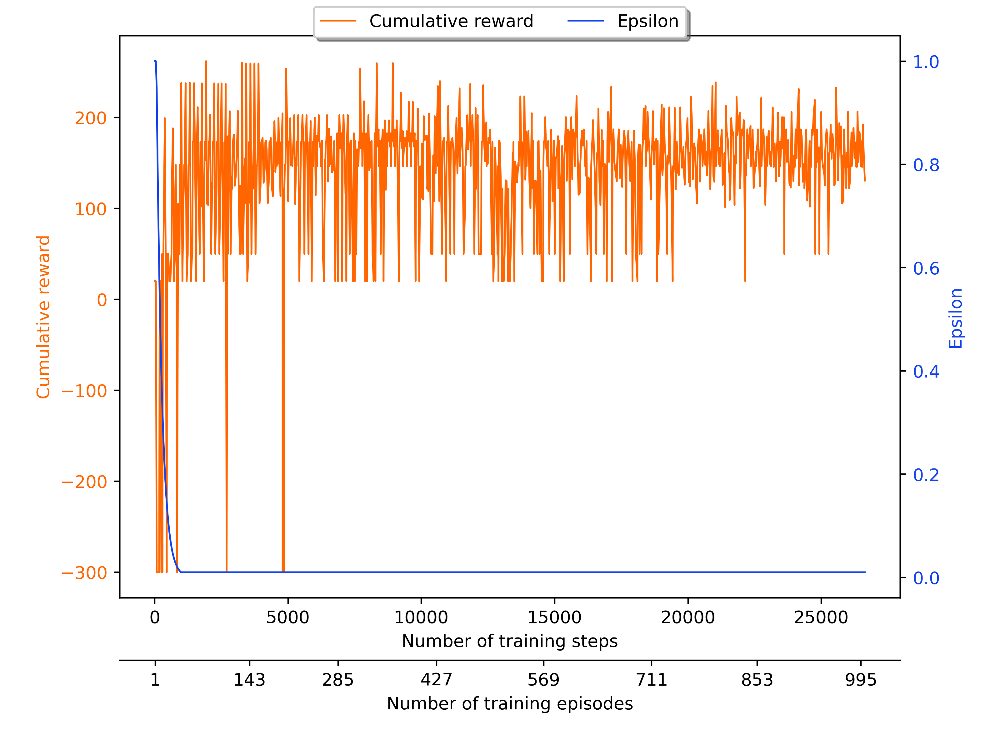
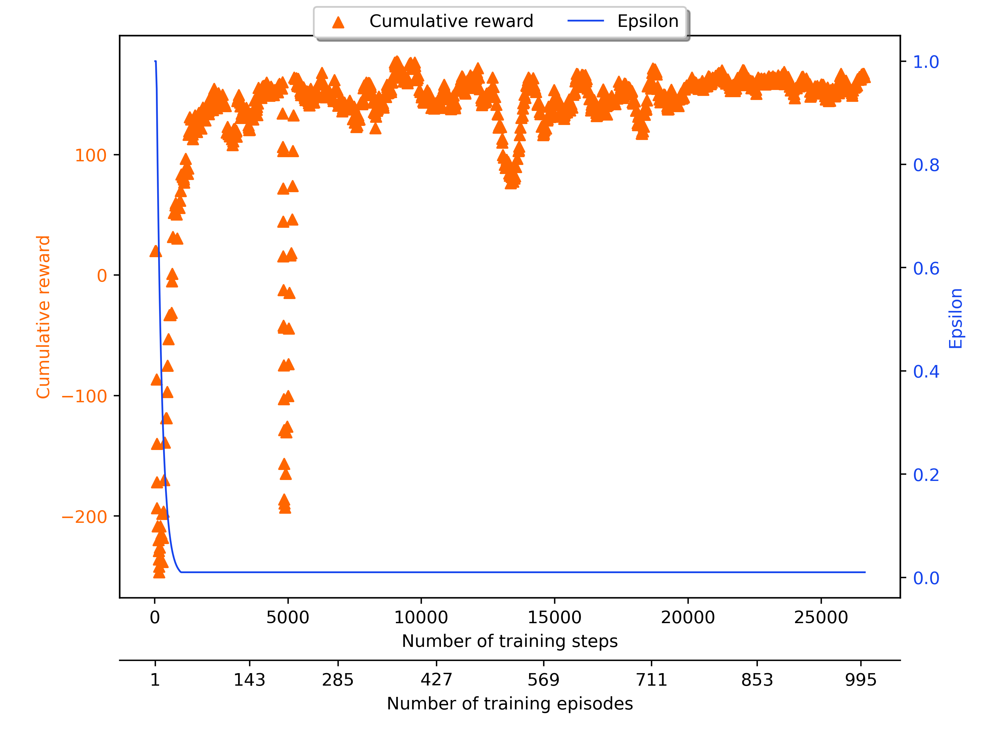

# Plot training curves (Reinforcement learning)

This directory provides a program to plot curves tracking the agent’s parameters during its learning process.

### Draw two line plots on the same chart that do not share the y-label
The chart shows the cumulative reward received and the epsilon value over time.

### Draw a line plot and a scatter plot on the same chart that do not share the y-label
The chart shows the average cumulative reward received and the epsilon value over time.

