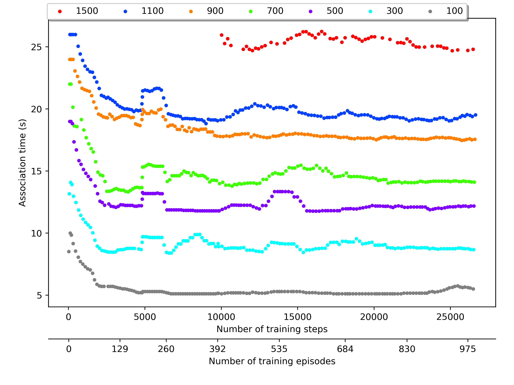

# Plot training curves (Reinforcement learning)

This directory provides a program to plot curves tracking the agent’s parameters during its learning process.

### Draw two line plots on the same chart that do not share the y-label
The chart shows the cumulative reward received and the epsilon value over time.

### Draw a line plot and a scatter plot on the same chart that do not share the y-label
The chart shows the average cumulative reward received and the epsilon value over time.

### Draw three line plots on the same chart that do not share the y-label
The chart shows the cumulative reward received, the association duration, and the epsilon value over time. (the y-axis for the association duration is inverted since it is inversely proportional to the reward) 

### Draw a line plot and two scatter plots on the same chart that do not share the y-label
The chart shows the average cumulative reward received, the average association duration, and the epsilon value over time. (the y-axis for the association duration is inverted since it is inversely proportional to the reward) 

### Draw several line plots on the same chart that share the y-label
The chart shows the association duration for several number of stations over time. 

### Draw several line plots on the same chart that share the y-label
The chart shows the average association duration for several number of stations over time. 

